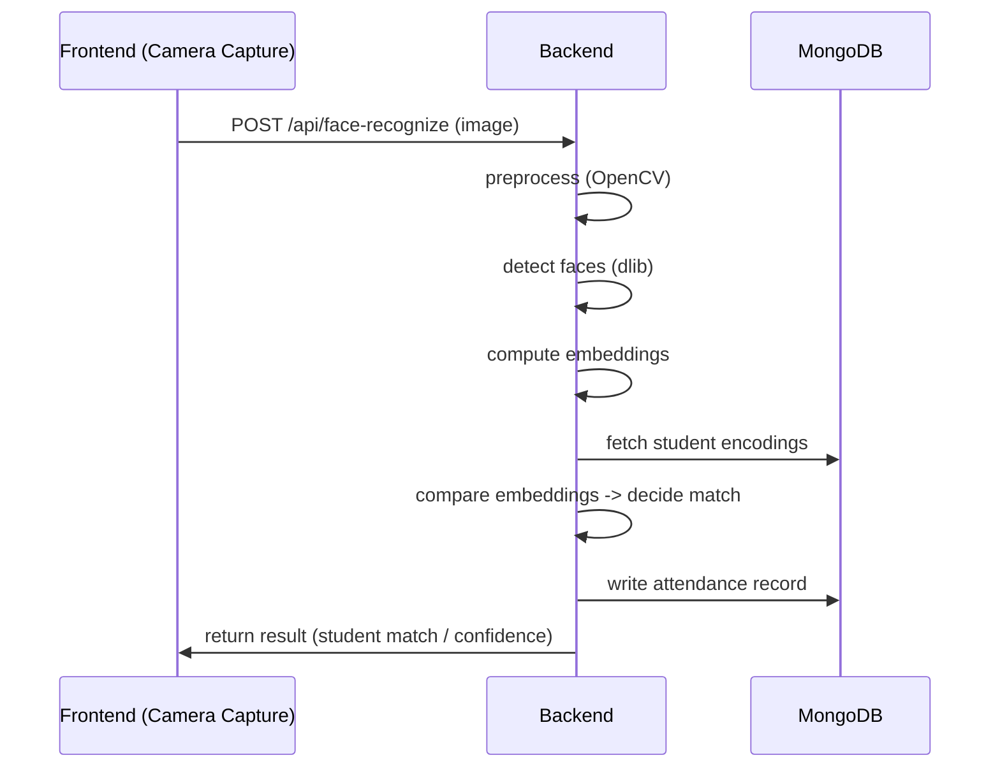

# Automated Attendance System — Comprehensive Project Documentation

Project: Automated-Attendance-System

Tagline: Modern, offline-capable facial-recognition attendance platform for schools (web dashboard, APIs, and Power BI integration).

---

## Table of Contents
- 1. Project Overview
- 2. Features (detailed)
- 3. Tech Stack (Frontend / Backend / Database / DevOps)
- 4. AI / ML (face recognition) — datasets, models, math
- 5. API Reference (selected endpoints discovered)
- 6. Architecture & Flows (Mermaid diagrams)
- 7. Environment Variables
- 8. Installation & Deployment (local / Docker / Render & Vercel)
- 9. Commands Reference (all commands found)
- 10. Security, Performance & Best Practices
- 11. Future Improvements
- 12. Contributors & License

---

## 1. Project Overview

Automated Attendance System is a full-stack application that automates student attendance using face recognition. It includes:
- A React frontend (admin, teacher dashboards, student registration, camera capture UI).
- A Python Flask backend providing REST APIs, authentication (JWT), face-recognition processing, and reporting.
- Optional database backends: MongoDB (preferred/present) and SQL fallback codepaths (SQLite/SQLAlchemy are present but repo enforces Mongo-only in recent versions).
- Integrations: Power BI for advanced reporting and export to Excel/PDF.

Why it exists: to reduce manual attendance burdens in environments with intermittent connectivity (offline-first behavior) and to provide analytics for educators.

Target users: school administrators, teachers, IT staff deploying attendance systems across classrooms and small school networks.

Core objectives:
- Accurate, repeatable attendance capture using face recognition
- Offline capability with synchronization
- Secure role-based access and reporting
- Easy deployment via Docker and cloud services (Render/Vercel)

Real-world use case: rural schools where network connectivity is unreliable — capture attendance locally and sync when online; provide aggregated dashboards to administrators via Power BI.

---

## 2. Features

Core features
- Face-based attendance marking (camera capture, registration, encoding storage)
- Student management: CRUD for student profiles and face enrollments
- Attendance records export (Excel/PDF) and Power BI integration
- Role-based access (Admin / Teacher / Principal)

AI / ML features
- Face detection and encoding using `face-recognition` (dlib based) and OpenCV preprocessing
- Encoding comparisons to identify students and mark attendance

Authentication
- JWT-based authentication using `flask-jwt-extended` (token issuance in `/api/auth/login`)

API integrations
- Power BI export hooks (service endpoints indicated in code and config)

Automation
- Offline data capture and background sync service (offline-sync service exists)

Dashboard/reporting
- Frontend dashboards (React + MUI), charts (Chart.js / Recharts), tables (`@mui/x-data-grid`)

Real-time systems
- Client uses webcam capture (react-webcam) and posts images for recognition; backend supports base64 or file uploads

Deployment features
- Dockerfiles for backend, Vercel config for frontend, Render / Fly templates included

Security features
- JWT, hashed passwords, CORS protections, secrets via environment variables

---

## 3. Complete Tech Stack

### Frontend
- Framework: React 18 (create-react-app)
- UI: Material UI (`@mui/material`, `@mui/icons-material`)
- State / Data fetching: `@tanstack/react-query` for server state
- Forms: `react-hook-form`
- Charts: `chart.js`, `react-chartjs-2`, `recharts`
- HTTP client: `axios`
- Webcam input: `react-webcam`
- Build tool: `react-scripts` (CRA)
- Dev-proxy: `proxy` set to `http://localhost:5000` for local dev

Why: CRA gives a predictable developer experience; MUI provides accessible, production-ready components; React Query simplifies caching and mutation flows for API-driven apps.

### Backend
- Runtime: Python 3.9 (Docker base `python:3.9-slim`)
- Framework: Flask (2.3.x)
- Extensions: Flask-CORS, Flask-JWT-Extended, Flask-PyMongo (optional), Flask-SQLAlchemy (legacy/fallback)
- API style: REST endpoints under `/api/*` (auth, students, attendance, reports)
- WSGI server: Gunicorn (production via `gunicorn.conf.py` and `app:app`)

Why Flask: lightweight, easy to extend for single-purpose APIs and integration with data-processing/ML code (OpenCV/dlib). JWT provides stateless auth suitable for SPAs.

### Database
- Primary: MongoDB (preferred in repo; `MONGODB_URI` required for recent code)
  - Collections: `users`, `students`, `attendance_records`, `system_settings`, etc.
- Legacy/optional: SQLite/SQLAlchemy (used for migration scripts and historical support)

Schema notes (inferred)
- `users` documents: password hashes, role, email, username, is_active
- `students` documents: roll_number, admission_number, class_name, section, full_name, face_encodings (stored as list/json), profile_image, created_at
- `attendance_records` documents: student_id, date, status, time_in/time_out, confidence_score

### DevOps / Deployment
- Docker: `backend/Dockerfile` and `backend/Dockerfile.render` (Render-specific)
- Frontend deployment: Vercel (`frontend/vercel.json`) or Netlify
- Backend deployment: Render (suggested) or Fly.io; `backend/render.yaml` template exists
- CI/CD: optional GitHub Actions (not included by default)

---

## 4. AI / ML Section (Face Recognition)

This repo uses classical face-recognition tooling (OpenCV + `face-recognition` which wraps dlib). There is no custom neural-network training pipeline in the repository; instead, face encodings are generated and compared at runtime.

### Dataset
- Not included in repository. Enrollment data is captured at runtime via UI (webcam) and stored in MongoDB.
- Data format: images (JPEG/PNG) and face encodings (numeric vectors serialized to JSON).

### Models Used
- `face-recognition` (dlib): produces 128-dimensional face embeddings per detected face.
- OpenCV used for camera capture and image preprocessing (resizing, color conversion).

Why chosen: dlib's face embeddings are compact, robust for face verification, and have an established Python wrapper. They are suitable for small-to-medium scale deployments without heavy GPU requirements.

### Typical Recognition Pipeline (inferred)
1. Capture frame from webcam (frontend `react-webcam`), send to backend (base64 or multipart).
2. Preprocess image with OpenCV (convert to RGB, optional resize).
3. Detect faces (dlib/HOG or CNN detector).
4. Compute 128-d face embedding for each face.
5. Compare embedding to stored encodings (L2 distance or cosine similarity) and apply threshold to determine match.

Mathematics / Equations used (practical explanations):

- Euclidean (L2) distance between two embeddings x, y:
$$d(x,y) = ||x - y||_2 = \sqrt{\sum_{i=1}^{128} (x_i - y_i)^2}$$
Used to measure similarity; smaller distance means more similar faces. Typical threshold: 0.4–0.6 (adjust experimentally).

- Cosine similarity and cosine distance:
$$\text{cosine\_sim}(x,y) = \frac{x \cdot y}{||x||_2\,||y||_2}$$
Cosine distance = 1 - cosine_sim. Often used when embeddings are normalized.

Practical impact: choose an appropriate threshold for the chosen similarity metric to balance false positives vs false negatives.

Loss functions / training: Not applicable — pre-trained dlib model is used. If extending to training custom models, standard classification losses (softmax cross-entropy) or metric learning (triplet loss) would apply.

---

## 5. API Documentation (Selected endpoints found)

Notes: All endpoints live under `/api/*`. Backend code registers many endpoints; below are the primary ones discovered.

Internal APIs

- POST `/api/auth/login`
  - Purpose: Authenticate user and return JWT access token.
  - Request: JSON `{ "username": "...", "password": "..." }`
  - Response: `200` `{ access_token, user, message }` or `401` on bad creds
  - Auth: returns JWT used in `Authorization: Bearer <token>` for protected routes

- GET `/api/health`
  - Purpose: health check
  - Response: `{ status: 'ok', message: 'Attendance System API is running' }`

- GET `/api/mongo-test`
  - Purpose: quick Mongo connectivity test (inserts a test doc)

- GET `/api/students`
  - Purpose: query students (supports `class`, `section`, `search` query params)

- POST `/api/students`
  - Purpose: create student document (includes roll/admission uniqueness checks)

- GET/PUT `/api/settings`
  - Purpose: read and update `system_settings`

- Reporting endpoints (examples)
  - `/api/reports/summary` — aggregated attendance summary
  - `/api/reports/student-analytics` — per-student metrics
  - `/api/reports/class-analytics` — class/section analytics
  - `/api/reports/attendance` — export to Excel or PDF (accepts `format=excel|pdf`)

Authentication & Middleware
- JWT tokens enforced in protected routes (Flask-JWT-Extended). CORS handled via `flask-cors` and custom before_request/after_request handlers ensure preflight responses include CORS headers.

External APIs
- Power BI integration — code references a Power BI service; configuration stored in `config` and `powerbi_routes.py` (backend/app routes indicate integration points). Authentication details depend on Power BI app credentials (not stored in repo).

Sample request (login):
```bash
curl -X POST https://<backend>/api/auth/login -H "Content-Type: application/json" -d '{"username":"admin","password":"admin123"}'
```

---

## 6. Project Architecture & Flow

Folder structure (top-level summary):

```
Automated-Attendance-System-main/
├─ backend/
│  ├─ app.py
│  ├─ requirements.txt
│  ├─ Dockerfile
│  ├─ Dockerfile.render
│  ├─ scripts/ (migrations, create_admin, migrate_sqlite_to_mongo.py)
│  └─ app/ (models/routes/services/utils)
├─ frontend/
│  ├─ package.json
│  ├─ src/ (components, pages, services)
│  └─ vercel.json
├─ config/
├─ database/
└─ README_DEPLOY.md
```

Request flow (high level):

```mermaid
flowchart LR
  Browser[User Browser (React SPA)] -->|API calls /images| Backend[Flask API]
  Backend --> MongoDB[(MongoDB Atlas)]
  Backend --> PowerBI[Power BI Export]
  Backend -->|Optional| FaceLib[OpenCV + dlib face encodings]
```

Backend architecture
- Monolithic Flask app with modular services: `attendance_service`, `face_recognition_service`, `powerbi_service`, and `offline_sync_service` (in `backend/app/services`). Routes are grouped under `routes/`.

Frontend architecture
- CRA app with componentized UI (`components/CameraCapture`, `pages/Admin`, `pages/Attendance`, etc.). Services (`services/apiService.js`, `authService.js`) centralize HTTP interactions and token storage.

AI pipeline flow (mermaid):


---

## 7. Environment Variables

Variables required by the codebase (collected from files):

| Variable | Purpose |
|---|---|
| MONGODB_URI | MongoDB Atlas connection string (primary DB). Required by current production branch. |
| JWT_SECRET_KEY | Secret for signing JWT tokens. |
| SECRET_KEY | Flask secret key (sessions, CSRF if used). |
| DATABASE_URL | Optional SQL database URL (legacy). |
| FLASK_ENV | `production` or `development` (controls debug). |
| PORT | Port used by container runtime (Render sets this automatically). |
| REACT_APP_API_BASE_URL | Frontend build-time API base (e.g. `https://<backend>/api`). |

Example `.env` (backend/.env.render.example provided):
```
MONGODB_URI=mongodb+srv://<user>:<password>@cluster0.xxxx.mongodb.net/attendance?retryWrites=true&w=majority
JWT_SECRET_KEY=replace-with-strong-secret
FLASK_ENV=production
# PORT is provided by the platform (Render/Fly)
```

Frontend `.env` example (`frontend/.env`):
```
REACT_APP_API_BASE_URL=http://127.0.0.1:5000/api
HOST=127.0.0.1
ALLOWED_HOSTS=localhost,127.0.0.1
```

Security note: Never commit secrets; use provider secret stores (Render / Vercel environment variables, GitHub secrets).

---

## 8. Installation & Deployment

### Local Setup (Backend)

1. Create and activate virtual environment:
```bash
cd backend
python -m venv .venv
source .venv/bin/activate  # Linux/macOS
.venv\Scripts\activate     # Windows PowerShell
```

2. Install dependencies:
```bash
pip install -r requirements.txt
```

3. Configure `.env` and start the app (requires `MONGODB_URI` for current code):
```bash
export MONGODB_URI="your_uri"
export JWT_SECRET_KEY="secret"
python app.py
```

4. Create admin user (helper script):
```bash
python create_admin.py
```

### Local Setup (Frontend)
```bash
cd frontend
npm ci
npm start   # development with CRA proxy
```

Important: After updating `frontend/.env` you must restart CRA dev server for env changes to take effect.

### Docker (Production / Render)

Backend (Render-friendly): use `backend/Dockerfile.render`.

Build locally (optional):
```bash
docker build -f backend/Dockerfile.render -t attendance-backend:latest backend
docker run -e MONGODB_URI="..." -p 5000:5000 attendance-backend:latest
```

Render deployment steps (summary):
1. Push repo to GitHub.
2. Create New Web Service on Render.
3. Set Root Directory: `backend` and Dockerfile path: `./Dockerfile.render`.
4. Add env vars (`MONGODB_URI`, `JWT_SECRET_KEY`, `FLASK_ENV`).
5. Deploy and monitor logs.

Frontend (Vercel): import project, set root to `frontend`, set `REACT_APP_API_BASE_URL` environment variable and deploy.

---

## 9. All Commands Used in This Project

### Frontend
- `npm install` / `npm ci` — install dependencies.
- `npm start` — start CRA dev server (uses `scripts/start-with-env-check.js` wrapper).
- `npm run build` — produce production `build` directory.

### Backend
- `python app.py` — run Flask dev server (not recommended for prod).
- `python create_admin.py` — create seeded admin user.
- `python scripts/migrate_sqlite_to_mongo.py` — migrate data from SQLite to Mongo (script present).

### Docker
- `docker build -f backend/Dockerfile -t attendance-backend:latest backend`
- `docker build -f backend/Dockerfile.render -t attendance-backend:render backend`
- `docker run -p 5000:5000 -e MONGODB_URI="..." attendance-backend:latest`

### Deployment / Hosting
- Vercel: import frontend and set build env `REACT_APP_API_BASE_URL`.
- Render: create Web Service (Docker), set env vars, point to `backend/Dockerfile.render`.

### Testing & Linting
- `pytest` — run backend tests (tests present under backend/tests)
- `black .` — format Python code
- `flake8` — static linting

---

## 10. Security & Best Practices

- Use strong secrets for `JWT_SECRET_KEY` and `SECRET_KEY` and store them in environment (Render/Vercel secret manager).
- Enforce HTTPS on production (Vercel/Render automatically provide TLS).
- Sanitize and limit file upload sizes (app sets `MAX_CONTENT_LENGTH` to 16MB).
- CORS: backend uses Flask-CORS and a custom `after_request` to echo `Origin` when credentials are used; fine-tune origins for production.
- Authentication: JWT tokens should be short lived; use refresh logic if required.
- Avoid committing `node_modules`, `.env`, or secrets to git.

---

## 11. Performance & Optimization

- Caching: consider introducing Redis for session or token blacklisting and for caching expensive aggregation/report queries.
- Lazy loading frontend pages and code-splitting with CRA dynamic imports.
- Optimize face recognition by resizing images, batching comparisons, and using indexed approximate nearest neighbor (ANN) for large registries.

---

## 12. Future Improvements

- Replace single-threaded face processing with a worker queue (Celery / RQ) and a GPU-backed inference service for scale.
- Add vector database (e.g., Milvus, Pinecone) for fast nearest-neighbor search of face embeddings.
- Add CI/CD GitHub Actions for automated tests, builds, and deploys.
- Improve privacy: store only embeddings (not raw images) or encrypt embeddings at rest.

---

## 13. Contributors & Credits

- Primary contact: jbhavesh.in@gmail.com (as found in README)
- See `LICENSE` file — project uses MIT license.

---

### Where to go next
- Push the repo to GitHub and configure Render + Vercel using the env file examples.
- If you want, I can: create GitHub Actions, add automated tests, or integrate a vector DB for embeddings.

---

_Generated by an automated project scan. If you want, I can commit this file into the repository and/or expand the API endpoint section into a machine-readable OpenAPI spec._
